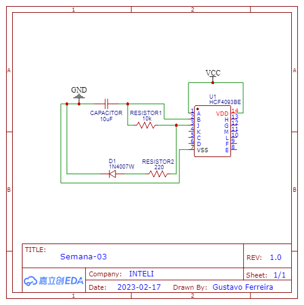

## Atividade realizada em conjunto com o colega João Carazzato
# Realizar a montagem do circuito oscilador utilizando o protoboard para validar seu funcionamento; 

[Link para vizualização do video](https://github.com/gustavofdeoliveira/2023-M1-programacao/blob/main/Semana-03/IMG_4223.MOV).
# Construir o circuito utilizando o EasyEDA
## OBS - Não consegui encontrar o LED Through hole no easyeda, sendo assim, utilizei o mais próximo possivel.

# Construir o circuito elaborado;

# Apresentar o funcionamento do circuito final elaborado.

[Link para vizualização do video](https://github.com/gustavofdeoliveira/2023-M1-programacao/blob/main/Semana-03/IMG_4205.MOV).
