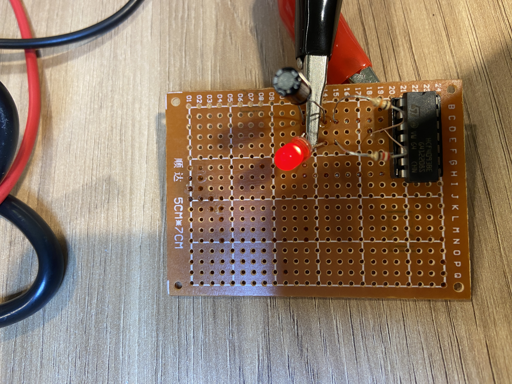

# Realizar a montagem do circuito oscilador utilizando o protoboard para validar seu funcionamento; 

# Construir o circuito utilizando o EasyEDA

# Construir o circuito elaborado;

# Apresentar o funcionamento do circuito final elaborado.

[Link para vizualização do video](https://github.com/gustavofdeoliveira/2023-M1-programacao/blob/main/Semana-03/IMG_4205.MOV).
